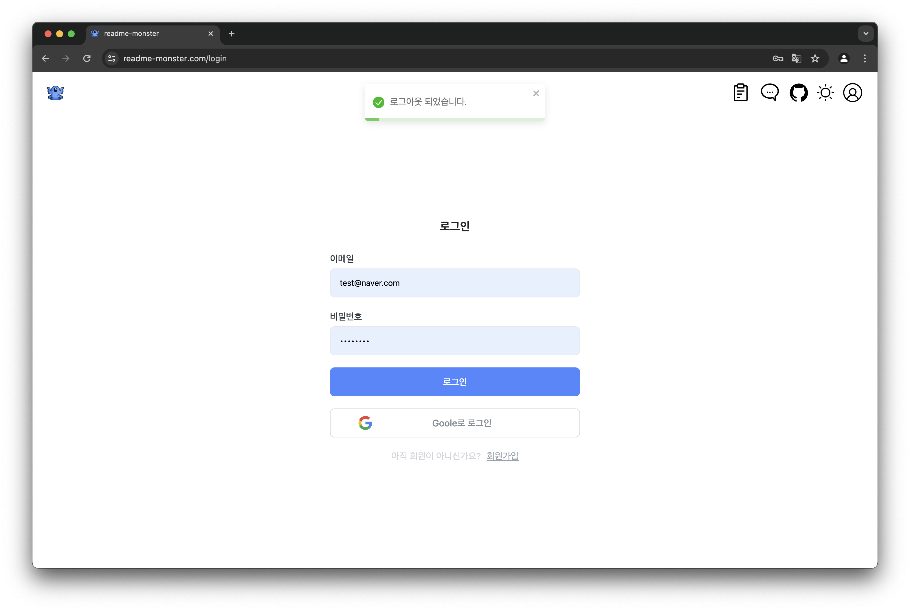

#  Readme-Monster 


##  RM은 어떤 서비스인가요?
- Readme Monster는 사용자가 직관적인 인터페이스를 통해 README 파일을 쉽게 구성할 수 있게 도와주고, OpenAI API를 활용하여 맞춤형 README 내용을 자동으로 생성해주는 온라인 플랫폼입니다. 

##  링크

- [서비스 바로가기](https://readme-monster.com/)
- [디자인](https://framer.com/projects/Untitled--Xf9L3K5EqFYT1UxUF3f9-8hseT)
- [Wiki](https://github.com/Readme-Monster/readme-monster/wiki)

##  RM 팀원을 소개합니다
|[](https://github.com/lee-ji-hong)|[](https://github.com/yonghyun421)|[](https://github.com/JaeHyup0504)|[](https://github.com/cks612)|
|:---:|:---:|:---:|:---:|
| 이지홍 | 김용현 | 이재협| 최규성 |

##  기술 스택

- **프론트엔드** 
  -   
- **백엔드** 
  - 
- **데브옵스**
  - 
- **도구 및 라이브러리**
  -     
- **패키지 매니저**
  - 
- **테스팅**
  - 
- **코드 품질**
  -  
- **배포**
  - 

##  기획 배경 (Background)
- 프로젝트 문서화는 개발 과정에서 매우 중요한 역할을 하지만, 많은 개발자들이 이를 번거롭고 시간이 많이 소모되는 작업으로 여겨 생략하거나 우선순위를 미루는 경우가 많습니다. 

- 이러한 문제 인식에서 출발한 README 자동 생성 도구는 다음과 같은 기획 배경을 가지고 있습니다.


###  동기 및 필요성

- **효율성 증대** 
  - 개발자들이 프로젝트의 기본 구조와 내용을 빠르게 문서화할 수 있도록 돕습니다. 
  이는 프로젝트 시작 단계에서 많은 시간을 절약할 수 있게 합니다.
- **표준화된 문서** 
  - README 파일은 프로젝트를 이해하는 데 필수적인 요소입니다. 자동 생성 도구는 프로젝트의 기본 정보, 설치 방법, 사용 방법 등을 표준화된 형식으로 제공함으로써 프로젝트의 전달력을 높입니다.
- **사용자 경험 개선** 
  - 명확하고 직관적인 문서는 사용자나 기여자가 프로젝트에 쉽게 접근할 수 있도록 돕습니다. 이는 개방성과 협력을 증진시키는 효과가 있습니다.

###  사용자 문제 해결

- 이 도구는 특히 문서 작성에 익숙하지 않거나, 문서 작성을 번거롭게 생각하는 개발자들을 위해 설계되었습니다. 
- 또한, 프로젝트 문서의 품질과 일관성을 유지하고 싶어하는 프로젝트 관리자나 팀 리더에게도 유용합니다.

###  이전 시도 및 개선점

- 과거에도 프로젝트 문서화를 자동화하려는 다양한 시도가 있었습니다. 이러한 도구들은 주로 템플릿 기반의 접근 방식을 채택했으나, 사용자의 개별 요구사항을 충분히 반영하지 못하는 경우가 많았습니다. 
- 최신 README 자동 생성 도구들은 이러한 한계를 극복하기 위해 더욱 세련되고 사용자 친화적인 기능을 제공하려고 합니다. 예를 들어, 프로젝트 구조를 자동 분석하여 관련 섹션을 자동으로 생성하고, 사용자가 특정 내용을 쉽게 추가하거나 수정할 수 있는 옵션을 제공합니다. 이러한 발전은 개발자 커뮤니티의 피드백과 기술 발전을 통해 가능해졌습니다.
  
---

- **이러한 배경과 동기는 README 자동 생성 도구가 개발자들 사이에서 필요한 해결책이었음을 보여줍니다. 이 도구는 프로젝트 문서화 과정을 간소화하고, 개발자들이 보다 중요한 개발 작업에 더 많은 시간을 할애할 수 있도록 지원합니다.**

##  설치 방법

yarn 방식으로 설치해주세요

```bash
  yarn install
  yarn start
``` 

##  사용 방법
1. Readme-Monster에 접속합니다.

2. 회원가입 및 로그인을 합니다. (로그인을 하지 않아도 사용 가능합니다.)


3. 원하는 섹션을 선택하고, 해당하는 내용을 입력하여 Readme 파일을 작성합니다. 작성한 파일은 복사하여 사용하거나, 다운로드하여 사용할 수 있습니다.

4. 자동으로 Readme 파일을 생성하는 기능을 사용하려면, Auto 탭으로 이동하여 레포지토리 주소와 OpenAI API Key를 입력하고 프로젝트에 대한 간단한 설명을 입력한 후 생성 버튼을 누릅니다.

5. 상단의 프로필 아이콘을 클릭하여 프로필 페이지로 이동할 수 있습니다. 프로필 페이지에서는 자신이 작성한 Readme 파일을 확인할 수 있습니다.

6. 로그아웃을 하려면 프로필 페이지에서 로그아웃 버튼을 클릭합니다.

7. Readme-Monster를 이용하면서 불편한 점이나 개선사항이 있다면, 상단의 말풍선 아이콘을 클릭하여 피드백을 남겨주세요.

8. 상단의 라이트모드/다크모드 버튼을 클릭하여 화면을 변경할 수 있습니다.


